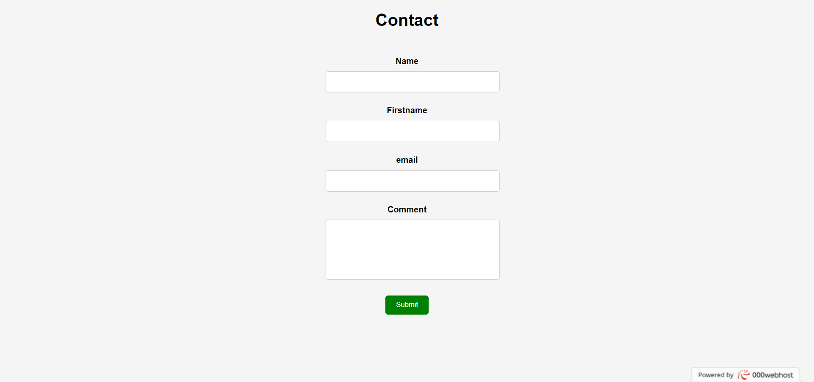

# Readme : hackers-poulette

## Who did the project:

Mariaule Aurélien

## What is it:

Exercices to learn form : data sanitised and validated,email gestion and sending to database

## When did you work on it :

Janvier 2023

## Where have you been:

BeCode

## link : 

https://declamatory-servant.000webhostapp.com/index.php

## What does it look like :

## Technos:

-html
-css
-js
-php
-sql

## The progression:

The email is setup but the script need a STMP server

## What's in it :

a small form with data sanitised and validated,email gestion and sending to database